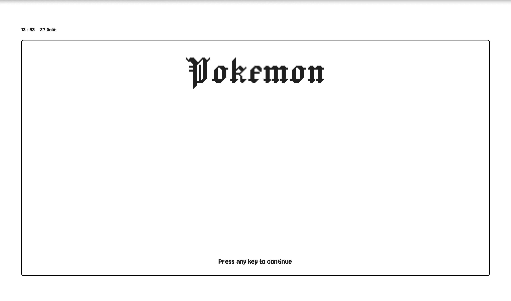
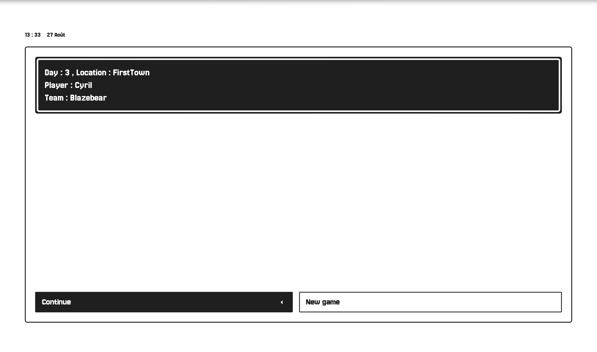
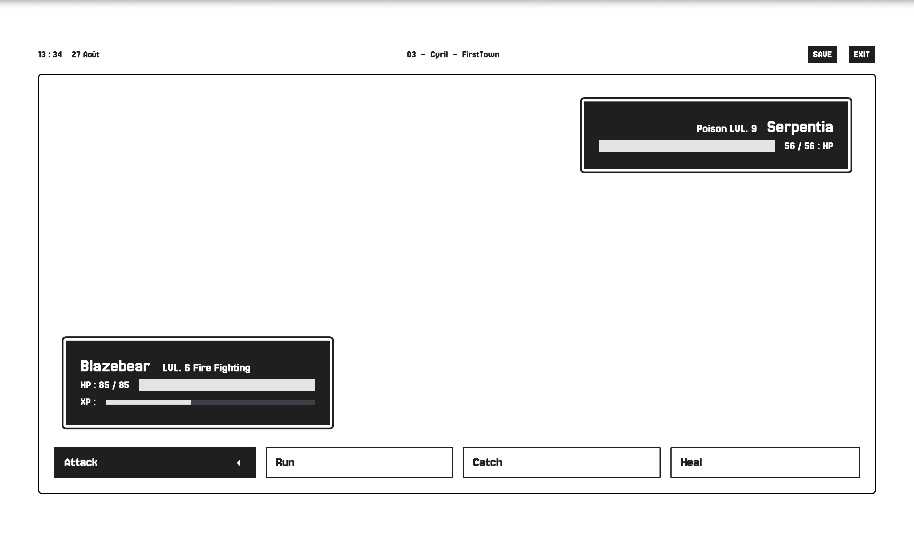

# Pokemon Gameplay React

<div style="display: flex; align-items: flex-start; flex-direction: column; gap: 1rem; justify-content: center; align-content: center">
  
  <div style="display: flex; flex-direction: row; flex-shrink: 1; gap: 1rem; justify-content: center; align-content: center">
    
    
  </div>
</div>


### Description

**Pokemon Gameplay React** is a text-based gameplay loop inspired by the Pokémon universe. Create your character, choose your Pokémon, and embark on an adventure in this interactive game.

### Key Features

#### Pkm Center

- **Revive Pokémon**: Restore your Pokémon's health.
- **View Logs**: Check activity logs of your Pokémon.

#### Team

- **Heal**: Heal your team.
- **Rename**: Change the names of your Pokémon.
- **Release**: Release a Pokémon into the wild.

#### Adventure

- **Random Battle**: Engage in random battles with wild Pokémon.

### Technologies

#### Frontend

- **React.js**: A JavaScript library for building user interfaces, particularly single-page applications.
- **TypeScript**: A typed superset of JavaScript that helps catch errors early through type-checking.
- **Tailwind CSS**: A utility-first CSS framework for quickly building custom designs.

#### Backend

- **Next.js**: A React framework that enables server-side rendering and the creation of static websites.
- **SQLite**: A lightweight, serverless, self-contained SQL database engine, perfect for small to medium-sized applications.

### Installation

#### Prerequisites

- Ensure that **SQLite** and **Node.js** are installed on your machine.

### Installation Instructions

To install and run the project locally, follow these steps:

1. **Clone the repository to your local machine:**

   ```sh
   git clone git@github.com:cyril-fl/pkm_gamplay_react.js.git
   ```

2. **Navigate to the project directory:**

   ```sh
   cd project
   ```

3. **Install the necessary dependencies:**

   ```sh
   npm install
   ```

4. **Start the application in development mode:**
   ```sh
   npm run dev
   ```

### Contribution & License

#### License

This project is licensed under the MIT License. See the [LICENSE](./LICENSE) file for details.

#### Contribution

No contributions are needed as this project is for educational purposes only.

### Disclaimer

Some French may appear in the code, mainly in comments. The frontend is intentionally in French as it is my mother tongue, and this project helps me track my internship applications.
